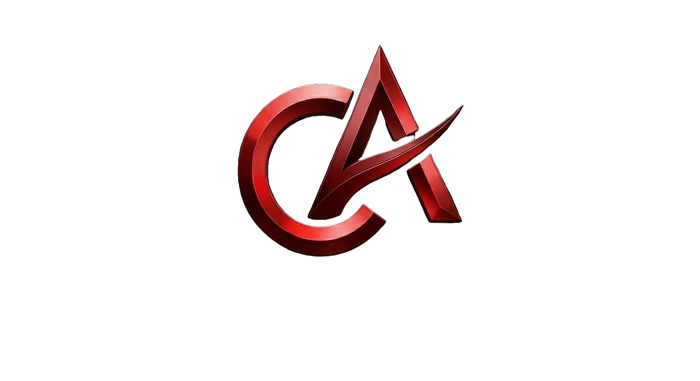

# 🚀 Portfolio — Carlos André

  
  
<h3>Estatísticas precisas, builds otimizadas e o meta do LoL em um único lugar.</h3>

**Full-Stack Developer** focado em React, Next.js e Supabase

---

## Sobre

Portfólio pessoal desenvolvido com foco em **performance, estética premium e interatividade extrema**. Cada detalhe foi pensado para transmitir a identidade visual e técnica do desenvolvedor — de animações fluidas a micro-interações responsivas.

## Stack

| Camada | Tecnologia |
|---|---|
| Framework | Next.js 15 (App Router) |
| Linguagem | TypeScript 5 |
| Estilização | Tailwind CSS 4 |
| Animações | Framer Motion |
| Fontes | Google Fonts — Montserrat |
| Ícones | Lucide React |
| Deploy | Vercel |

## Funcionalidades

- **Scroll Progress Bar** — barra de progresso de leitura no topo
- **Partículas animadas** — background dinâmico com partículas flutuantes
- **Navbar adaptativa** — transparente no topo, sólida ao scroll, menu mobile
- **Seção Hero** — logo 3D com órbitas giratórias e floating cards
- **Skills** — barras de progresso animadas com `whileInView`
- **Projetos** — cards com thumbnail, hover effects e links para demo/GitHub
- **Footer/Contato** — copy de e-mail automático + status de disponibilidade
- **Design responsivo** — mobile-first, fluido em qualquer tela

## Projetos em Destaque

### [Omni Gestão](https://omni-gestao-pro-six.vercel.app)
Plataforma ERP completa para controle de estoque e fluxo de caixa, com relatórios inteligentes e gestão de unidades operacionais.

### [Meta Diff](https://meta-diff.vercel.app)
Dashboard de analytics para League of Legends utilizando a Riot Games API para insights de desempenho e tier list em tempo real.

---

**Carlos André** — Full-Stack Developer

