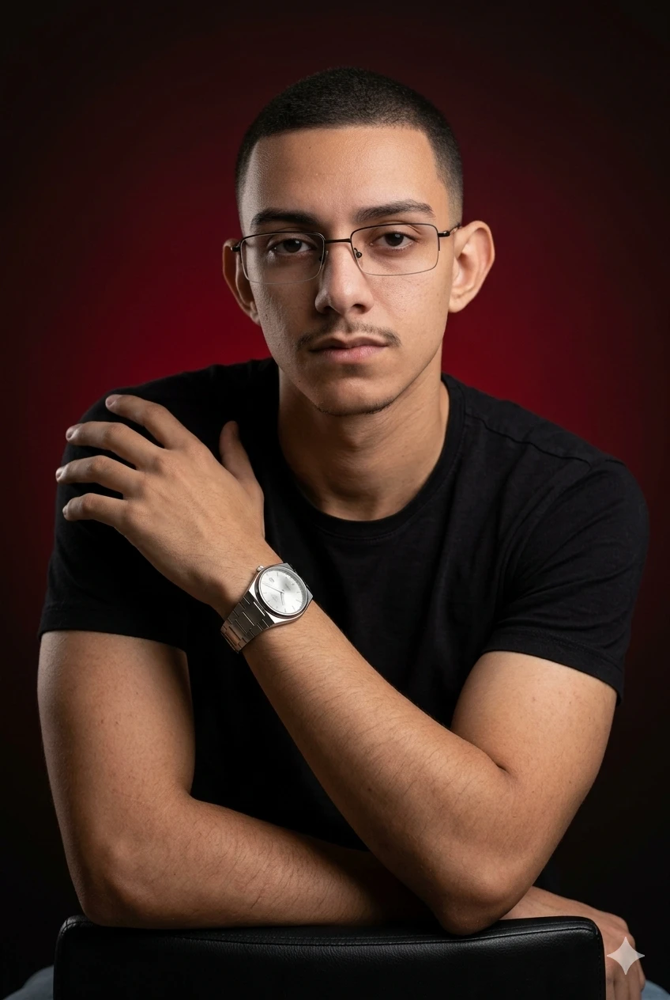

# 🚀 Carlos André - Portfólio & Soluções Digitais Premium

  
  
<h3>Transformando complexidade em simplicidade através de design impecável, automações inteligentes e código de alta performance.</h3>

  
  
  

---

## 💻 Sobre o Projeto

Este portfólio é um ecossistema interativo de **alta fidelidade visual, performance e usabilidade**, desenvolvido com tecnologias modernas para atuar como vitrine de engenharia de software, inteligência artificial e automações. 

O design é inspirado no tema **Dracula** com micro-interações fluidas via Framer Motion, suporte a múltiplos idiomas (PT/EN) e um assistente conversacional integrado alimentado por IA (Gemini).

---

## 🛠️ Tecnologias & Ferramentas do Portfólio

| Categoria | Stack Principal |
| :--- | :--- |
| **Framework & Engine** | Next.js 16 (App Router) |
| **Linguagem** | TypeScript 5 |
| **Estilização** | Tailwind CSS v4 / Vanilla CSS |
| **Animações & Efeitos** | Framer Motion / Canvas de Redes Neurais nativo |
| **Assistente Virtual** | Google Gemini (Gemini 3.5 Flash) via API Gateway Serverless |
| **Hospedagem & Deploy** | VPS (Hostinger) com Coolify |

---

## 📂 Projetos em Destaque no Portfólio

### 🍣 [Sushi House Premium (Sushi PDV)](https://projetos.techcarlos.com.br/sushi)
Sistema ERP e PDV (Ponto de Venda) completo para restaurantes de culinária japonesa. Possui PDV touchscreen rápido, módulo de impressão automática de comandas via daemon em Python local para a cozinha e roteamento inteligente de delivery via webhook no N8N.
*   **Stack:** Next.js 14, React 18, SWR, TailwindCSS, Prisma, Python, N8N, PostgreSQL, Sockets.

### 🏋️ [FitGym](https://projetos.techcarlos.com.br/fitgym)
Ecossistema de fitness composto por aplicação Web para administradores, aplicativo Mobile nativo para alunos e API RESTful robusta. Permite acesso a fichas de treinos dinâmicas com cronômetros de descanso integrados, controle financeiro de matrículas e dashboards de evolução.
*   **Stack:** Java 17, Spring Boot, Spring Security (JWT), Hibernate/JPA, Flutter (Dart), PostgreSQL, SQLite.

### 📊 [Horizonte Aprendizado (Horizon BI)](https://projetos.techcarlos.com.br/horizonte)
Dashboard inteligente de Business Intelligence (BI) para consolidação e monitoramento de métricas operacionais e financeiras corporativas. Conta com cruzamento de dados de múltiplos departamentos com latência zero e gráficos interativos otimizados via Recharts.
*   **Stack:** Next.js 16, React 19, TailwindCSS v4, Recharts, Radix UI, Zustand, PostgreSQL.

### 💈 [Barber+ (Barber Plus)](https://projetos.techcarlos.com.br/barber)
Plataforma SaaS de alta performance para gestão estratégica e agendamento comercial em tempo real. Centraliza a reserva inteligente de horários com controle estrito de concorrência no banco de dados para evitar overbooking, painel de barbeiros e relatórios financeiros.
*   **Stack:** Next.js 16, React 19, TailwindCSS v4, Framer Motion, PostgreSQL.

### 🏥 [VitaMed](https://projetos.techcarlos.com.br/vitamed)
Sistema integrado de gestão médica e prontuário eletrônico (PEP) focado em usabilidade clínica e segurança. Conta com histórico clínico centralizado, receitas digitais, atestados, grade de agendamento dinâmica e total conformidade de acessibilidade (WCAG).
*   **Stack:** Next.js 16, React 19, TailwindCSS v4, Radix UI, PostgreSQL.

---

## 💼 Trajetória & Experiência Profissional

### 🏥 Clínica Odontológica Espaço Família — Desenvolvedor Full-Stack Freelancer
*Dezembro/2025 – Julho/2026*  
*   Assistente de IA com RAG treinado nas regras da clínica centralizado no Chatwoot para WhatsApp/Instagram/Site.
*   Agendamento em tempo real integrado ao PostgreSQL com validação anti-conflito.
*   Monitoramento de conversão de anúncios no Grafana conectado ao banco de dados.

### 🚀 Neo Vertex (Consultoria em Tecnologia) — Desenvolvedor Front-End & QA Freelancer
*Março/2026 – Abril/2026*  
*   Desenvolvimento completo de site institucional em Next.js com animações Framer Motion (tema Dracula).
*   Atuação como QA de APIs REST em back-ends Java / Spring Boot.
*   Automações de integração contínua de homologação via N8N.

### 🤖 MILULI (Escola de Música & Artes) — Desenvolvedor de IA e Automação Freelancer
*Abril/2024 – Março/2026*  
*   Automação de triagem de atendimento com IA no WhatsApp e Instagram.
*   Fluxos de coleta de dados e qualificação de leads com ManyChat e N8N.
*   Desenvolvimento da landing page institucional hospedada na Hostinger.

---

## 📧 Contato Comercial

**Carlos André** — *Desenvolvedor de Software & Especialista em Soluções SaaS / IA*  

*   ✉️ **Email:** techcarlosandre@gmail.com
*   💬 **WhatsApp:** (21) 98266-5121
*   💼 **LinkedIn:** [devcarlosandre](https://www.linkedin.com/in/devcarlosandre/)
