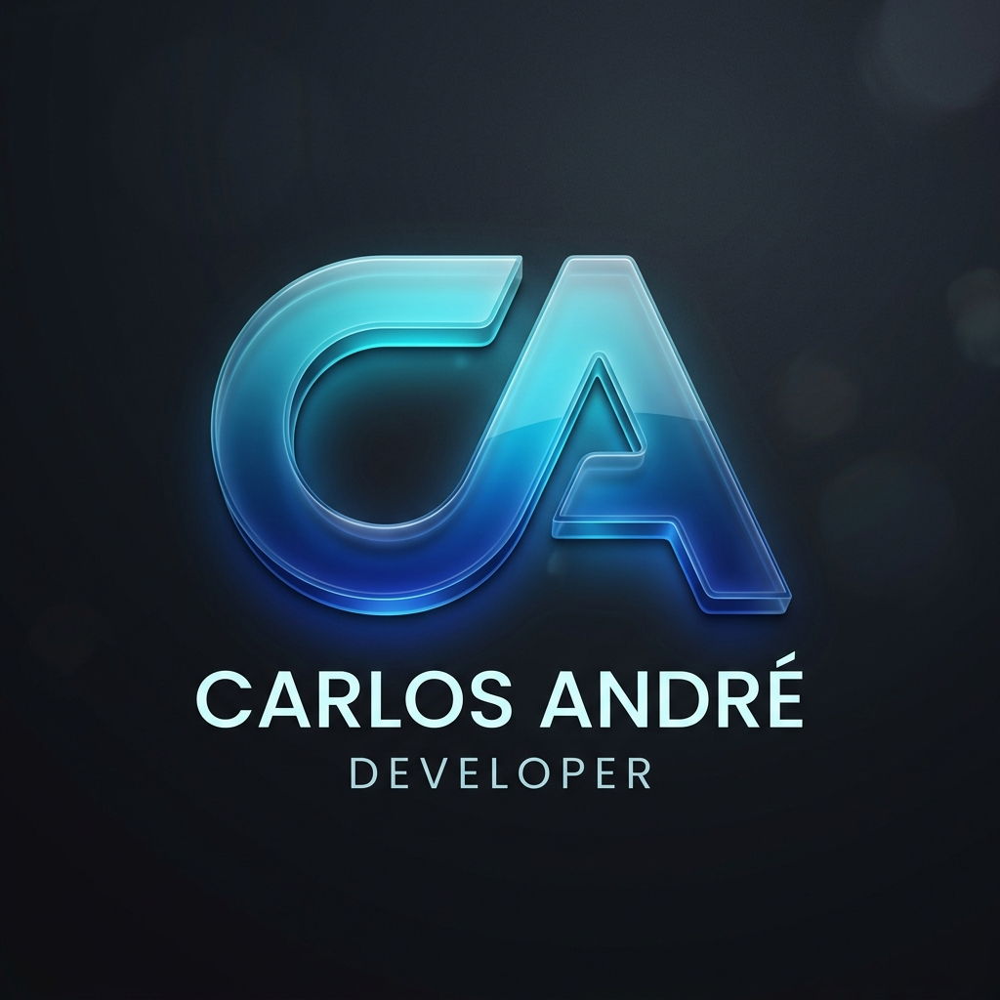

# 🚀 Carlos André - Soluções Full-Stack Premium

  
  
<h3>Transformando complexidade em simplicidade através de design impecável e código robusto.</h3>

  
  

---

## 💻 Sobre o Projeto

Este portfólio não é apenas uma vitrine, mas uma demonstração técnica de **performance, estética premium e interatividade**. Desenvolvido com as tecnologias mais modernas do ecossistema React, focado em entregar uma experiência de usuário fluida e memorável.

## 🛠️ Tecnologias & Ferramentas

| Categoria | Stack |
| :--- | :--- |
| **Framework** | Next.js 15 (App Router) |
| **Linguagem** | TypeScript 5 |
| **Estilização** | Tailwind CSS 4 |
| **Animações** | Framer Motion |
| **Backend/DB** | Supabase / PostgreSQL |
| **Deploy** | Vercel |

## ✨ Funcionalidades Principais

- 🚀 **Performance Extrema** — Otimização de imagens e carregamento sob demanda.
- 🎨 **UI/UX Premium** — Design minimalista com animações de micro-interação.
- 📱 **Totalmente Responsivo** — Experiência perfeita em desktops, tablets e smartphones.
- ⚡ **Animações Fluidas** — Transições suaves utilizando Framer Motion.

## 📂 Projetos em Destaque

### [Omni Gestão](https://omni-gestao-pro-six.vercel.app)
Plataforma ERP completa para controle de estoque e fluxo de caixa, com relatórios inteligentes e gestão de unidades operacionais.

### [Meta Diff](https://meta-diff.vercel.app)
Dashboard de analytics para League of Legends utilizando a Riot Games API para insights de desempenho e tier list em tempo real.

---

## 📧 Contato Comercial & Desenvolvedor

**Carlos André** — *Especialista em Soluções SaaS*  

